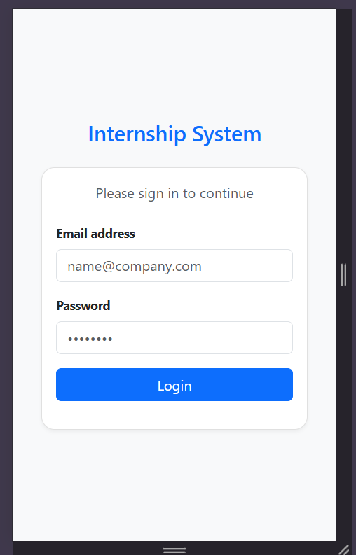
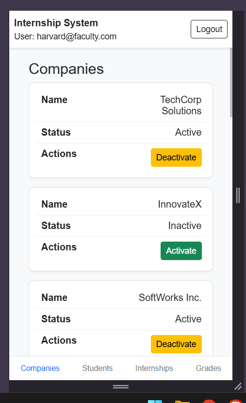
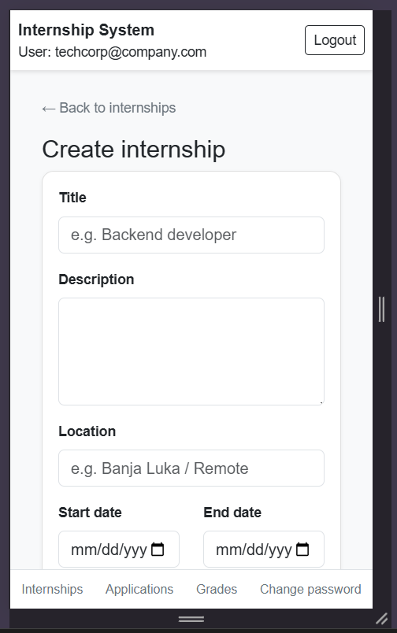
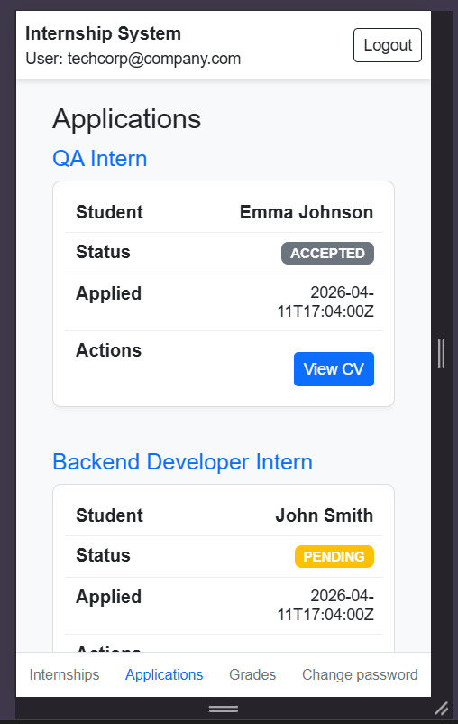
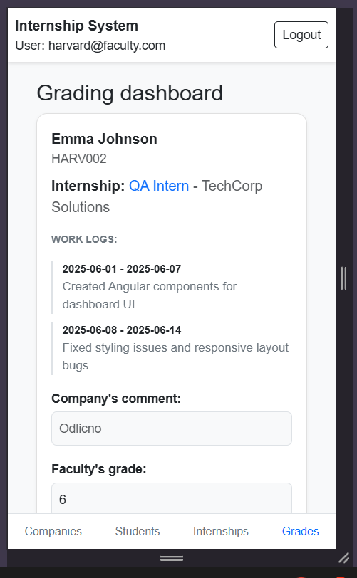
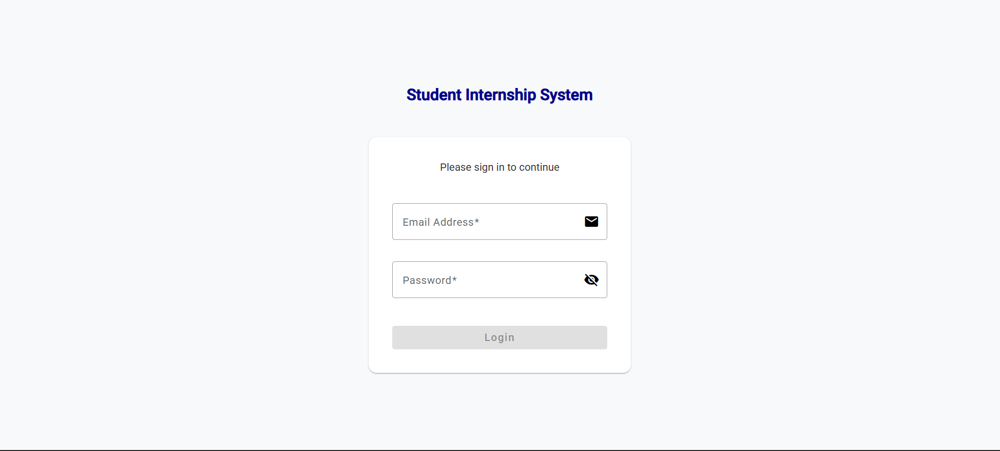
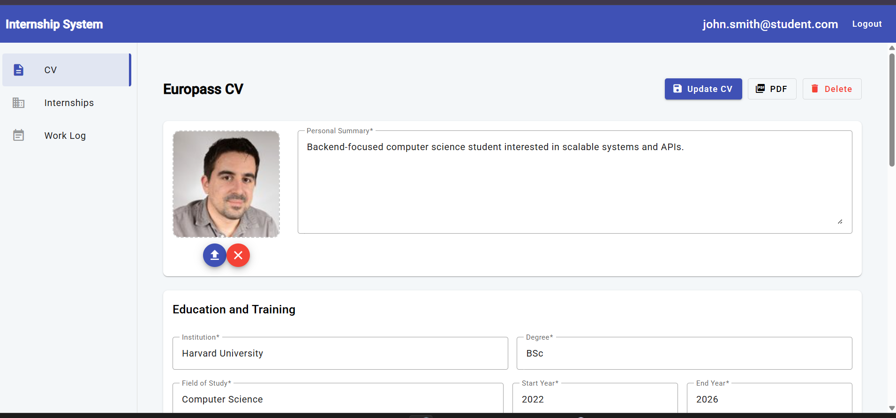
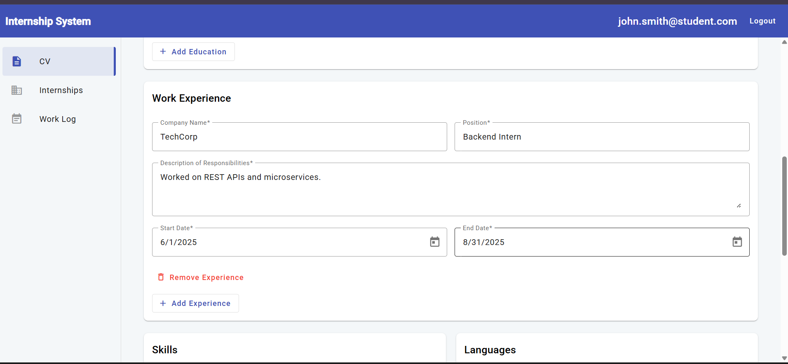
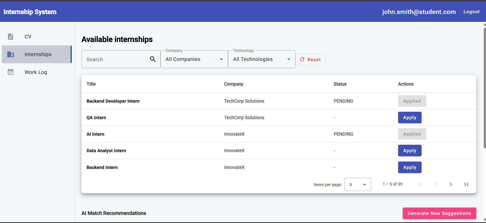
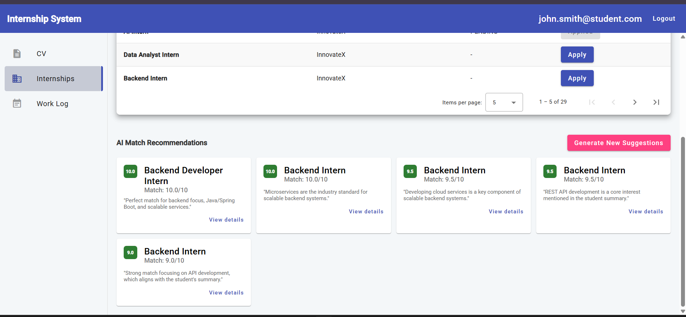

## 🎓 Student Internship Management System

This project is a system for managing student internships, enabling interaction between students, faculty, and companies.

It consists of a central backend service and three client applications, each tailored to a specific user role.

---

## ⚙️ Technologies

* **Backend:** Spring Boot
* **Student Application:** Angular + Angular Material
* **Faculty Application:** JSP (JSP M2) + Bootstrap
* **Company Application:** JSP + Bootstrap
* **Database:** MySQL
* **AI Integration:** Gemini API

---

## 🏗️ System Architecture

The system is composed of the following components:

### 🔹 Spring Boot Backend

* RESTful API for all client applications
* Handles business logic and data processing
* Communicates with the MySQL database
* Integrates with Gemini API for AI recommendations

---

### 🔹 Student Application (Angular)

* Modern single-page application
* Built with Angular and Angular Material
* Designed for a **rich user experience on desktop devices**
* Communicates with backend via REST API

---

### 🔹 Faculty Application (JSP)

* Server-side rendered application
* Built using JSP (JSP M2) and Bootstrap
* Designed with a focus on **smaller screens and mobile devices**
* Shares a **consistent UI design with the company application (same CSS styling)**
* Provides administrative functionalities
* Communicates with backend via REST API

---

### 🔹 Company Application (JSP)

* Server-side rendered application
* Built using JSP and Bootstrap
* Optimized for **smaller screens and mobile usage**
* Uses the **same CSS styling as the faculty application for a unified look and feel**
* Enables companies to manage internships and applicants
* Communicates with backend via REST API

---

## 👩‍🎓 Features

### Student Application

* Login (no registration)
* CV CRUD - create, read, update, delete (Europass format + PDF download option)
* Browse and apply for internships
* Search and filter internships
* View AI-based recommendations (card layout)
* Maintain weekly work diary
* Pagination or optimized list rendering

---

### Faculty Application

* Login (no registration)
* Manage companies (create, activate, deactivate accounts)
* View all internship postings
* Manage students (CRUD operations)
* Import students from CSV file
* Monitor student progress
* Review work diaries and assign grades

---

### Company Application

* Login (no registration)
* Manage internships (CRUD operations)
* Define technologies, duration, and requirements
* View student applications
* Review CVs (PDF download available)
* Accept or reject candidates
* Evaluate students and leave feedback
* Change account password

---

## 🤖 AI-Based Internship Recommendations

The system uses **Gemini API** to generate personalized internship recommendations.

### Process:

1. Backend collects:

   * Student CV data
   * All available internships

2. Data is sent to the AI model

3. AI returns:

   * Compatibility score (range 0–1)
   * Short explanation

4. Backend:

   * Ranks internships
   * Returns top 5 recommendations to the student

---

## 🗄️ Database

* Database system: **MySQL**
* A single shared database is used by all applications

The project includes:

* SQL script for **database schema creation**
* SQL script for **initial data population (test data)**

These scripts allow quick setup for development and testing.

---

## 🚀 Running the Project

### Backend (Spring Boot)

```bash id="m5l9sx"
cd backend
mvn spring-boot:run
```

---

### Student Application (Angular)

```bash id="p8w2kj"
cd student-app
npm install
ng serve
```

App runs at:

```id="c4x7zn"
http://localhost:4200
```

---

### JSP Applications

Deploy both applications to Apache Tomcat:

* Faculty app → `/faculty-app`
* Company app → `/company-app`

---

## 🗂️ Project Structure

```id="y7n3qp"
/backend
/student-app
/faculty-app
/company-app
/database
/screenshots
```

---

## 📸 Screenshots

### Login Page - Company and Faculty app


### Companies Page - Faculty app


### Create Internship Page - Company app


### Applications Page - Company app


### Grading Page - Company app


### Login Page - Student app


### CV Page - Student app




### Internships Page - Student app




---

## ⚠️ Notes

* Gemini API key is stored in `application.properties`
* User registration is not implemented (accounts are predefined)
* All applications use the same backend and database
* JSP applications are optimized for **mobile and smaller screens**
* Faculty and company applications share a **common CSS for a consistent UI design**

